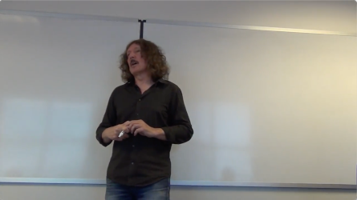

# Video Watching Acceleration

Better experience for watching videos where people talk.

This script was intended to watch small scale math lectures/seminars, usually hours long.

## Sample

Before: 28 seconds (Click to play):

[](assets/original.mp4)

After: 20 seconds (Click to play):

[](assets/processed.mp4)


## Motivation

I watch videos fast-forward, usually x1.25. Faster than that I cannot fully comprehend the utterances anymore.
But when presented together with subtitles, I can comfortably follow the argument of the speaker with playback speed of x1.5 or more (depends on the speaker of course).
Also, I usually skip the pauses by pressing right-arrow button on the keyboard with VLC. But it is easier to pause when I can't follow the video, than skipping when I can fully follow the video.

Personal result is:
- Speed up by subtitles: about 25%
- Speed up by long pause skip: about 60%
- Overall speed-up: about 200%

## Methodology

1. Prepare subtitle

    [Whisper by OpenAI](https://github.com/openai/whisper)(MIT license) was used.
    To better adjust timestamps, [stable-ts](https://github.com/jianfch/stable-ts) was used.

2. Clip long pauses

    [Silero-VAD](https://github.com/snakers4/silero-vad)(MIT License) was used.

3. When watching, fast-forward according to your preference

    Any media player with playback speed control will do; e.g. VLC.

## How to use

After installing requirements by `pip install -r requirements.txt`,

Start with a directory that contains videos.

```
data_src/
    - lecture01.mp4
    - lecture02.mp4
    - ...
```

Run ```python -m video_watching_acceleration.transcribe mp4 data_src data_src --whisper-model small```

```
data_src/
    - lecture01.mp4
    - lecture01.srt
    - lecture02.mp4
    - ...
```

Run ```python -m video_watching_acceleration.vad mp4 data_src data_src```
```
data_src/
    - lecture01.mp4
    - lecture01.srt
    - lecture01_vad.csv
    - lecture02.mp4
    - ...
```

Finally, run ```python -m video_watching_acceleration.edit mp4 data_src data_dst```
```
data_src/
    - lecture01.mp4
    - lecture01.srt
    - lecture01_vad.csv
    - lecture02.mp4
    - ...
data_dst/
    - lecture01.mp4
    - lecture01.srt
    - lecture02.mp4
    ...
```

Enjoy!
